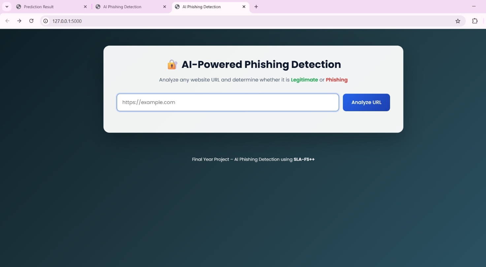
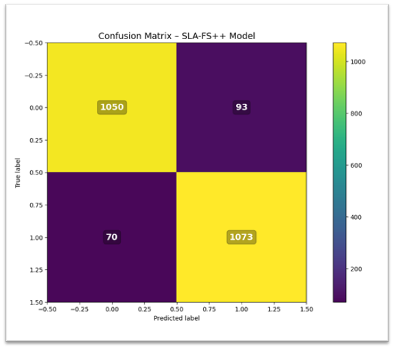

# AI-Powered Phishing Detection System

This project detects phishing websites using Machine Learning and Explainable AI techniques.

## Features
- Phishing URL detection
- Random Forest classifier
- SHAP analysis
- Flask web interface

## Technologies Used
- Python
- Flask
- Scikit-learn
- SHAP
- Pandas
- NumPy

## Model Accuracy
96%
## Screenshots

### Home Page

### Prediction Result

### Confusion Matrix

## How to Run

pip install -r requirements.txt
python app.py